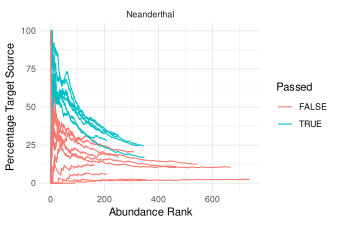

# cuperdec 
<!-- badges: start -->
[](https://github.com/jfy133/cuperdec/actions)
[](https://codecov.io/gh/jfy133/cuperdec?branch=master)
[](https://doi.org/10.5281/zenodo.4561901)
[](https://CRAN.R-project.org/package=cuperdec)
<!-- badges: end -->

R package to generate 'Cumulative Percent Decay' curves, with optional 
filtering functions, for microbial taxonomic profiles.



These curves aim to represent the level of 'endogenous' content of microbiome 
samples, such as ancient dental calculus, to help to identify samples with low
levels of preservation that should be discarded for downstream analysis.

## Installation

This package is still in development. To install for testing, you can run
the following

```r
# install.packages("devtools")
devtools::install_github("jfy133/cuperdec")
```

## Documentation

Please see `vignettes/cuperdec-intro.Rmd`.

## Acknowledgments

Irina Velsko (@ivelsko), Zandra Fagerness (@ZandraFagernas), and Lena Semerau 
for testing and bug reports.
